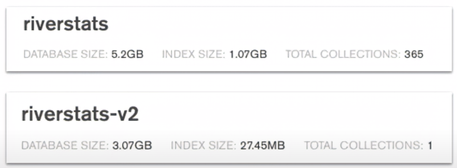

# MongoDB
## Rules to Live by

- Rule #1: Embed unless there is reason not to (see other rules). Data that is commonly accessed/updated together should be stored together.
- Rule #2: Avoid JOINs whenever possible. But don't be afraid of JOINs that can give a better Schema design.
- Rule #3: Arrays cannot be unbounded. EG: Growing without end. (MongoDB Document size is limited to [16 MB](https://www.mongodb.com/docs/manual/core/document/#document-size-limit) when writing this)
- Rule #4: Needing to access an object on it's own is a compelling reason to not embed it.
- Rule #5: (Obvious but not) Design your Schema based on the unique needs of your Application.

## Anti-Patterns (solutioning Patterns included)

- Anti-Pattern: [Massive Arrays](#massive-array-anti-pattern) or unbounded arrays
  - Pattern: [Embedded Approach](#massive-array-pattern-embedded)
  - Pattern: [Reference Approach](#massive-array-pattern-reference)
  - Pattern: [Extended Reference Approach](#massive-array-pattern-extended-reference)
- Anti-Pattern: [Massive Collections](#massive-collections-anti-pattern)


### Massive Array Anti-Pattern

The below example Schema could result in Unbounded "employees" array. To the point where the Building document for City Hall grows beyond the 16 MB max size and no more employees can be added.

```json
// Building Document
{
  "_id": "abc123",
  "name": "City Hall",
  "city": "Pawnee",
  "state": "IN",
  "employees": [{
    "_id": "zbc321",
    "first": "John",
    "last": "Doe",
    "phone": "1234567890"
  }, {
    "_id": "232fff",
    "first": "Jane",
    "last": "Doe",
    "phone": "0987654321"
  }, ...]
}
```

### Massive Array Pattern Embedded

Data Duplication isn't an issue in terms of storage cost. BUT can be an issue if the Building data is changing regularly. You will end up having to update multiple documents every time which comes at a cost.

```json
// Employee Collection
[{
  // Employee Document
  "_id": "zbc321",
  "first": "John",
  "last": "Doe",
  "phone": "1234567890",
  "building": {
    "_id": "abc123",
    "name": "City Hall",
    "city": "Pawnee",
    "state": "IN"
  }
}, {
  // Employee Document
  "_id": "232fff",
  "first": "Jane",
  "last": "Doe",
  "phone": "0987654321",
  "building": {
    "_id": "abc123",
    "name": "City Hall",
    "city": "Pawnee",
    "state": "IN"
  }
}, ...]
```


### Massive Array Pattern Reference

Only Drawback to this approach is the need to aggregate data together using $lookup (JOIN) which if done too often can also be costly.

```json
// Employees Collection
[{
  // Employee Document
  "_id": "zbc321",
  "first": "John",
  "last": "Doe",
  "phone": "1234567890",
  "building_id": "abc123"
}, {
  // Employee Document
  "_id": "232fff",
  "first": "Jane",
  "last": "Doe",
  "phone": "0987654321",
  "building_id": "abc123"
}, ...]

// Buildings Collection
[{
  "_id": "abc123",
  "name": "City Hall",
  "city": "Pawnee",
  "state": "IN"
}, ...]
```

Example Lookup (JOIN) for above scenario

```javascript
db.buildings.aggregate(
  [
    {
      $lookup: {
        from: 'employees',
        localField: '_id',
        foreignField: 'building_id',
        as: 'employees'
      }
    }
  ]
)
```

Results of the Lookup above

```json
{
  "_id": "abc123",
  "name": "City Hall",
  "city": "Pawnee",
  "state": "IN",
  "employees", [{
    "_id": "zbc321",
    "first": "John",
    "last": "Doe",
    "phone": "1234567890",
    "building_id": "abc123"
  }, {
    "_id": "232fff",
    "first": "Jane",
    "last": "Doe",
    "phone": "0987654321",
    "building_id": "abc123"
  }]
}
```

### Massive Array Pattern Extended Reference

Duplicate some but not all of the data in the 2 collections. We only duplicate the data that is frequently accessed together. Knowing that the Name and State for the building won't change often.

```json
// Employees Collection
[{
  // Employee Document
  "_id": "zbc321",
  "first": "John",
  "last": "Doe",
  "phone": "1234567890",
  "building": {
    "name": "City Hall",
    "state": "IN"
  }
}, {
  // Employee Document
  "_id": "232fff",
  "first": "Jane",
  "last": "Doe",
  "phone": "0987654321",
  "building": {
    "name": "City Hall",
    "state": "IN"
  }
}, ...]

// Buildings Collection
[{
  "_id": "abc123",
  "name": "City Hall",
  "city": "Pawnee",
  "state": "IN"
}, ...]
```

### Massive Collections Anti-Pattern

Below is a screenshot of the same data separated into 365 collections or in 1 collection and the difference in size of the Database and Index. This is a direct result of the way that the underlying service "WiredTiger" which is used by MongoDB. Creating a separate file for each Collection. Anything beyond 10,000 collections results in performance degradation.


